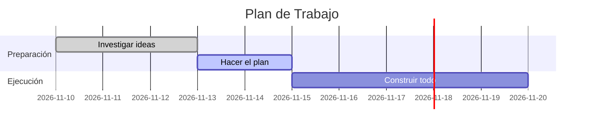

# gestion-proyecto-gantt

## Cronograma del Proyecto

```mermaid
gantt
    title Plan de Trabajo
    dateFormat YYYY-MM-DD

    section Preparación
    Investigar ideas : done, t1, 2026-11-10, 3d
    Hacer el plan    : active, t2, after t1, 2d

    section Ejecución
    Construir todo   : t3, after t2, 5d
```
